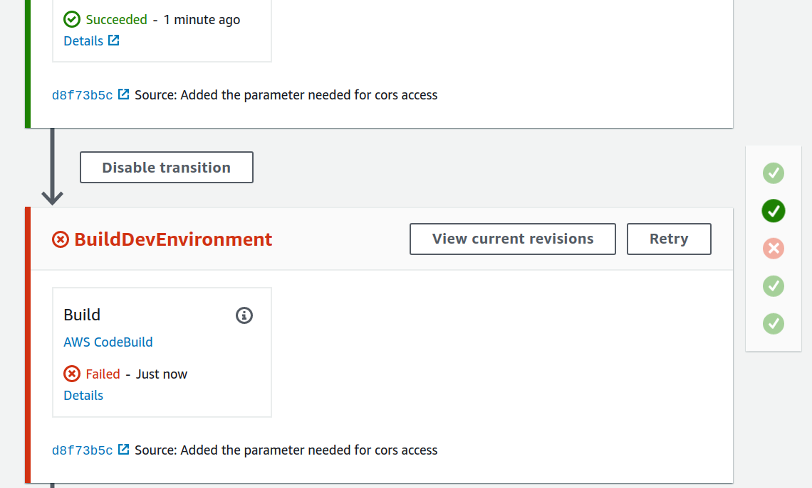
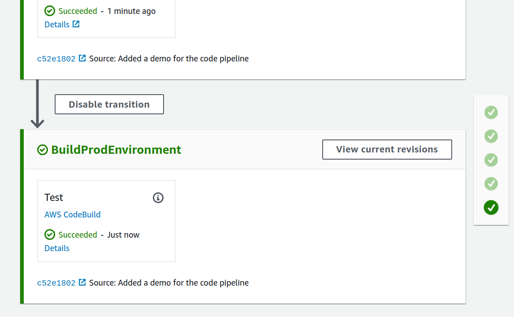

[](https://github.com/rrigato/pipelinetemplate.git)   

# {{cookiecutter.project_name}}
{{cookiecutter.project_description}}


## table_of_contents


- [{{cookiecutter.project_name}}](#{{cookiecutter.project_name}})
  - [table_of_contents](#table_of_contents)
    - [dev_tools](#dev_tools)
      - [cfn_lint](#cfn_lint)
      - [git_secrets](#git_secrets)
      - [ci_cd_pipeline](#ci_cd_pipeline)
    - [project_directory_overview](#project_directory_overview)
      - [builds](#builds)
      - [devops](#devops)
      - [logs](#logs)
      - [templates](#templates)
      - [tests](#tests)


### dev_tools

Follow [this aws example](https://forums.aws.amazon.com/thread.jspa?threadID=228206) on how to have multiple rsa key pairs in the same local machine being used with different accounts

#### cfn_lint
[cfn-lint](https://github.com/aws-cloudformation/cfn-python-lint.git) Provides yaml/json cloudformation validation and checks for best practices

- Install

```
    pip install cfn-lint
```

- Run on a file
```
    cfn-lint <filename.yml>

    cfn-lint templates/code_pipeline.yml
```

- Run on all files in Directory
```
    cfn-lint templates/*.yml
```


#### git_secrets

[git secrets](https://github.com/awslabs/git-secrets.git) is a command line utility for validating that you do not have any git credentials stored in your git repo commit history

This is useful for not only open source projects, but also to make sure best practices are being followed with limited duration credentials (IAM roles) instead of long term access keys

- Global install

```
    git init

    git remote add origin https://github.com/awslabs/git-secrets.git

    git fetch origin

    git merge origin/master

    sudo make install
```

- Web Hook install

Configuring git secrets as a web hook will ensure that git secrets runs on every commit, scanning for credentials
```
    cd ~/Documents/devdocs

    git secrets --install

    git secrets --register-aws
```


- Run a git secrets check recursively on all files in directory

```
git secrets --scan -r .
```

#### ci_cd_pipeline
Below is a high level description of the CI/CD pipeline:

1) When new code is pushed to the dev branch this triggers a code pipeline revision

2) Cloudformation dev stack will be spun up to enable a clean environment that replicates production and to run test scripts


3) Any build errors that occur testing on this qa environment will halt the pipeline before any changes are made to production




1) Once all tests are passed the dev environment cloudformation stacks are deleted and the changes are migrated to production. Code Build tests are run on prod and once successfully passed the changes are merged into the master branch




### project_directory_overview
Provides information on each directory/ source file

#### builds

- buildspec_dev.yml = Buildspec to use for the development (QA)
    CodeBuild project

- buildspec_prod.yml = Buildspec to use for the prod deployment CodeBuild project that merges dev branch to master

#### devops

ci.sh = miscellaneous awscli commands to configure environment

#### logs
- directory for python log files


#### templates

- bucket_template.yml = Simple Cloudformation template that creates an s3 bucket

- code_pipeline.yml = Creates CodeCommit, CodeBuild, and Code Pipeline resources necessary for CI/CD pipeline


#### tests

- requirements_dev.txt = python requirements installed in buildspec_dev.yml

- requirements_prod.txt = python requirements installed in buildspec_prod.yml

- test_dev_aws_resources.py = dev environment tests run in the CodeBuild project for builds/buildspec_dev.yml

- test_prod_aws_resources.py = test cases run for the prod CodeBuild environment in builds/buildspec_prod.yml